##### error1:
執行 sudo nginx -t 發現有語法錯誤，多加了一個逗號;

##### error2:
查看`/var/log/myweb/error.log`
    

    
fix: 給予`/var/myweb/index.html` 權限 sudo chmod -R 755 /var/myweb
    
##### error3:
查看 `/var/log/nginx/error.log`
    

    
查看哪個 process 誰在佔用 80 port: sudo lsof -i :80
    
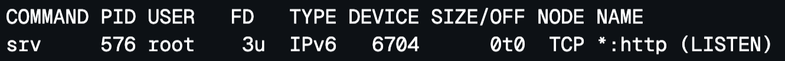

fix: 清除佔用 80 port 的 process: sudo kill <PID>

##### error4:
curl localhost

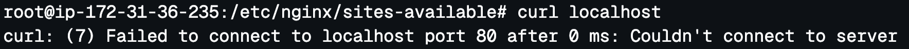

竟然在本機上連不上，直覺猜防火牆擋了，執行 sudo iptables -L 查看 iptables 

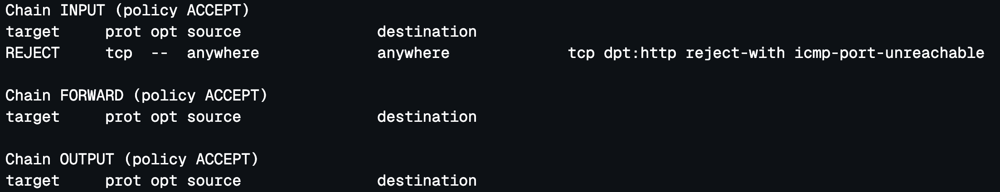

fix: 執行 sudo iptables -F 清除規則

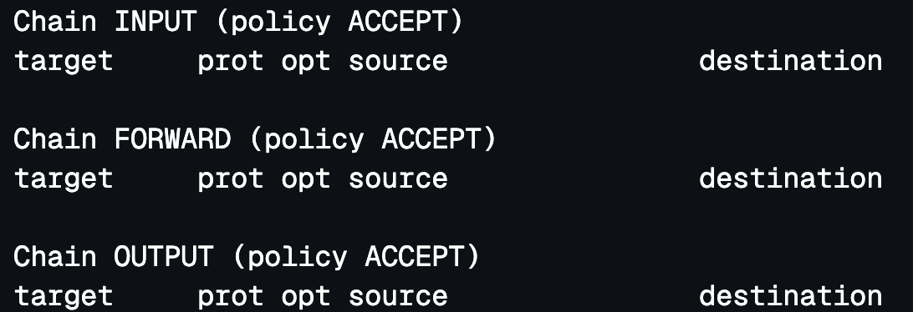

##### done:

執行 curl localhost

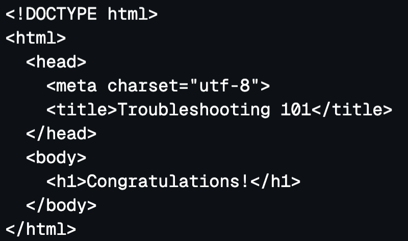

修好了 🎉 🎉

##### 心得:

debug 的過程很辛苦，但解出來之後隨之而來的是滿滿的成就感。
##### 進階題1:

由於 reboot 後，iptables 的組態檔會遺失，因此可以靠netfilter-persistent 來儲存對iptables 的設定
```bash
# Install iptables-persistent if not already installed
apt-get update
apt-get install -y iptables-persistent

# Save iptables rules
iptables-save > /etc/iptables/rules.v4

# Ensure netfilter-persistent is enabled and started
systemctl enable netfilter-persistent
systemctl start netfilter-persistent
```

但，那個 process 還是會佔用 80 port

於是，開始抽絲剝繭，找到那個 srv 到底是啥
```bash
grep -rn "Haha, I am the fake web server." /
```
找到

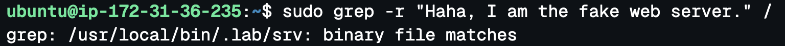

再找

```bash
grep -r "/usr/local/bin/.lab/srv" /
```

找到了，原來這個src.service 是被掛在 systemd 下的

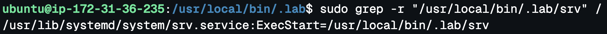
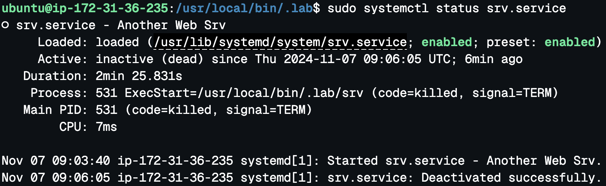

現在要叫 systemd 不要自動啟動它

```bash
# Stop the service
sudo systemctl stop srv.service
# Disable the service
sudo systemctl disable srv.service
# Verify the status
sudo systemctl status srv.service
```
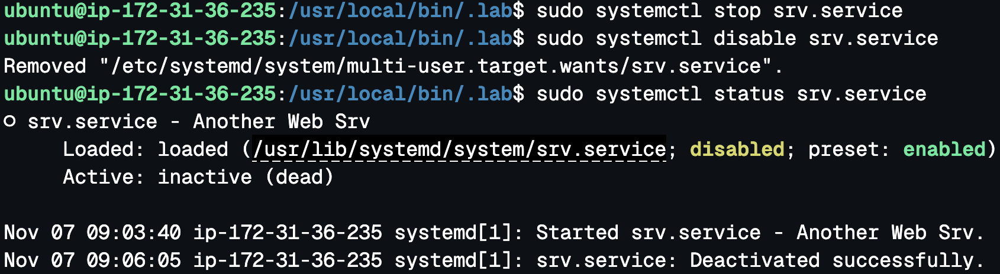

接下來要讓nginx 自動啟動

```bash
# Stop the service
sudo systemctl stop nginx
# Disable the service
sudo systemctl enable nginx
# Verify the status
sudo systemctl status nginx
```
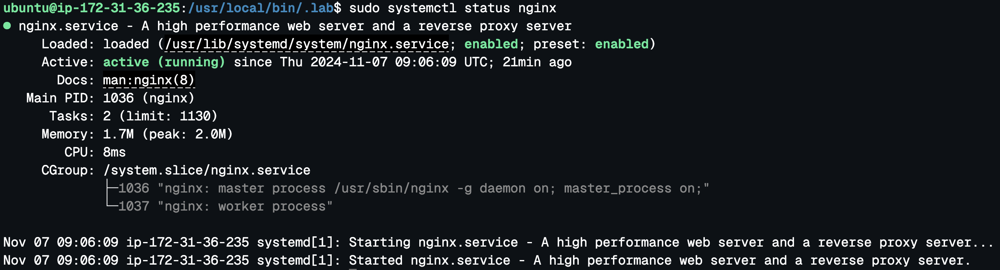

done

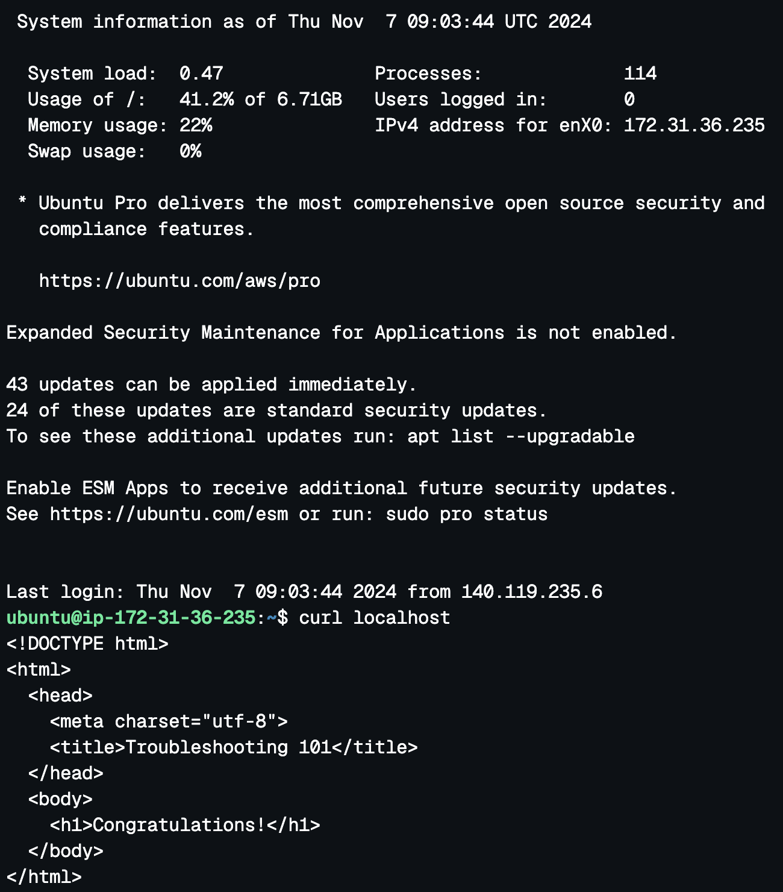

##### 進階題2:
從根目錄找出大檔案，以人類可讀格式從大到小排序，並只顯示前 20 筆結果。
```bash
du -ah / | sort -rh | head -n 20
```
檔案大到連 sort 產生暫存檔都放不下


嘗試另一種方法，找出大於 100MB 的文件
```
sudo find / -type f -size +100M -exec ls -lh {} \; | awk '{ print $NF ": " $5 }'
```
得到

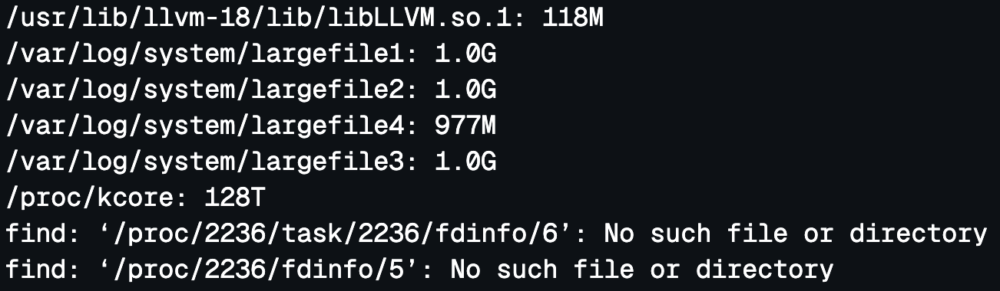

執行 sudo rm -rf system 將largefile 1-4 刪掉就OK了

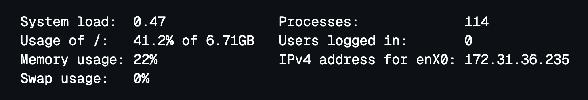


